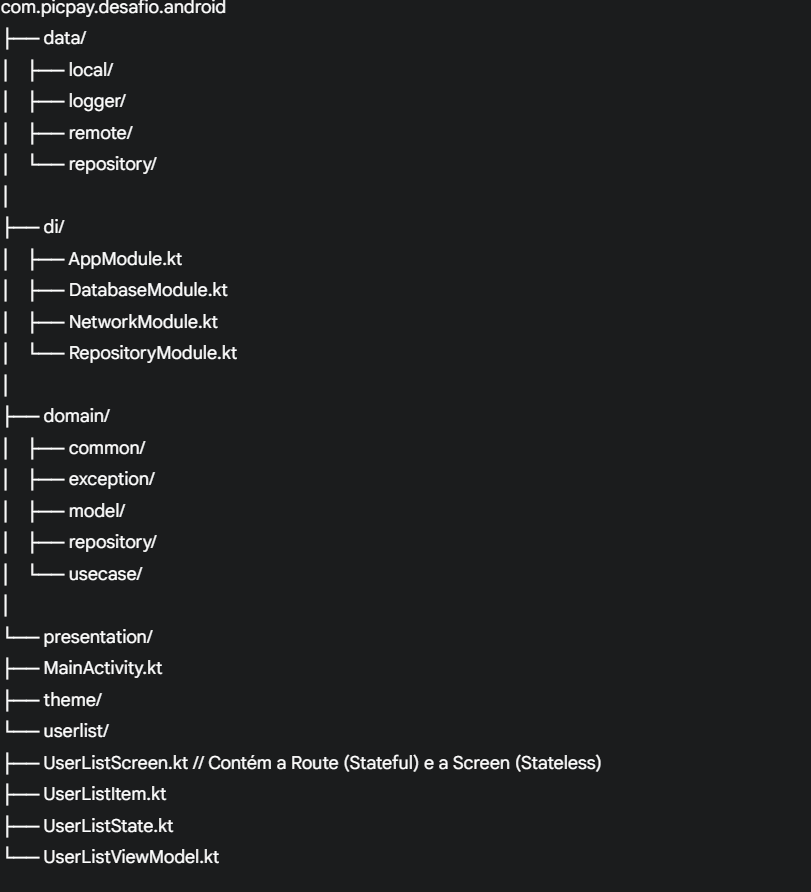

# PicPay - Desafio Android

# Wiki do Projeto
Este documento serve como um guia técnico completo para a arquitetura, tecnologias, padrões e estratégica de testes utilizados na construção do desafio.

## 1. Visão Geral e Arquitetura

O projeto foi estruturado para ser robusto, testável e escalável, utilizando uma combinação da arquitetura MVVM (Model-View-ViewModel) com os princípios da Clean Architecture.

As responsabilidades são divididas em 3 camadas principais:

- **Presentation (Apresentação):** Responsável pela UI e interação com o usuário. Contém a `Activity`, os `Composables` (Views), e o `ViewModel`. O `ViewModel` não conhece a UI, apenas expõe um estado (`StateFlow`) que a UI observa.
- **Domain (Domínio):** O coração da aplicação. Contém a lógica de negócio pura, sem nenhuma dependência de frameworks. Aqui ficam os `Models` de negócio (ex: `User`), as interfaces dos `Repository` e os `UseCases` (interactors).
- **Data (Dados):** Responsável por buscar e salvar os dados, seja de uma fonte remota (API) ou local (banco de dados). Implementa as interfaces do repositório definidas na camada de `domain`.

O fluxo de dados é unidirecional, garantindo previsibilidade e facilidade de depuração:
`UI ➔ ViewModel ➔ UseCase ➔ Repository ➔ Fontes de Dados (API/Room)`

## 2. Stack de Tecnologia (Bibliotecas)

| Finalidade | Biblioteca(s) |
| :--- | :--- |
| **UI (Interface Gráfica)** | Jetpack Compose, Material 3 |
| **Injeção de Dependência** | Hilt |
| **Comunicação de Rede** | Retrofit, OkHttp (com Logging Interceptor) |
| **Parsing de JSON** | Moshi (com Codegen) |
| **Banco de Dados (Cache)** | Room |
| **Programação Assíncrona**| Kotlin Coroutines & Flow |
| **Gerenciamento de Estado** | StateFlow |
| **Carregamento de Imagens** | Coil |
| **Testes Unitários** | JUnit 4, MockK, Turbine, Truth |
| **Testes Instrumentados** | AndroidX Test (JUnit4), Compose Test Rule, Hilt Testing |

## 3. Estrutura de Pacotes

A organização das pastas foi feita para espelhar as camadas da arquitetura:

## 4. Padrões e Conceitos Chave

- **Single Source of Truth (Fonte Única da Verdade):** A UI sempre lê os dados do banco de dados (Room). O `UserRepositoryImpl` é o orquestrador que busca dados da API e os usa para manter o banco de dados local sempre atualizado. Isso garante que o app tenha um bom funcionamento offline e uma UI consistente.
- **Wrapper `Resource`:** Uma classe `sealed` (`Loading`, `Success`, `Error`) é usada para encapsular o estado dos dados que fluem do repositório para o ViewModel, tornando o tratamento de cada estado explícito e seguro.
- **UI "Stateless" e "Stateful":** A UI foi dividida em dois Composables:
  - `UserListScreen`: Um componente "burro" (stateless) que apenas recebe um `UserListState` e o renderiza. É fácil de testar e visualizar.
  - `UserListRoute`: Um componente "inteligente" (stateful) que se conecta ao `ViewModel`, coleta o estado e o passa para a `UserListScreen`.

## 5. Estratégia de Testes

A estratégia de testes visa garantir a qualidade em cada camada, usando a ferramenta certa para cada trabalho.

### 5.1. Testes Unitários (JVM)

Testes de lógica pura que rodam rapidamente na JVM, sem a necessidade de um emulador.

**Classes Testadas:**
- **`GetUsersUseCase`**: Valida que a lógica de negócio principal (chamar o repositório) está correta.
- **`UserListViewModel`**: Valida a lógica de gerenciamento de estado, garantindo que o ViewModel traduz os `Resource`s para o `UserListState` correto.
- **`UserRepositoryImpl`**: Valida a lógica de orquestração de dados (API vs. Cache) usando mocks.

### 5.2. Testes Instrumentados (Ambiente Android)

Testes que rodam em um emulador ou dispositivo Android real para validar a integração com o framework.

**Classes Testadas:**
- **`UserDao`**: Valida as queries SQL do Room usando um banco de dados em memória.
- **`AppDatabase`**: Valida a lógica de criação do banco e o padrão singleton.
- **`UserListScreen`**: Valida a lógica visual, renderizando o Composable de forma isolada e verificando se ele exibe os estados de sucesso, erro e loading corretamente.
- **`MainActivity`**: Atua como um "smoke test", garantindo que o app abre e exibe a tela inicial sem quebrar.

### 5.3. O Que NÃO Testamos (e o porquê)

Não escrevemos testes para classes que são puramente de configuração e não contêm lógica de negócio customizada.

- **Módulos do Hilt:** São "manuais de instrução" para o Hilt. A prova de que funcionam é o app compilar e rodar.
- **`AndroidLogger` e `Application`:** São classes "boilerplate" sem lógica própria. Sua funcionalidade é validada pela execução do app e dos testes instrumentados.
- **Classes de Modelo (`data class`):** Apenas guardam dados e não possuem lógica a ser testada.

